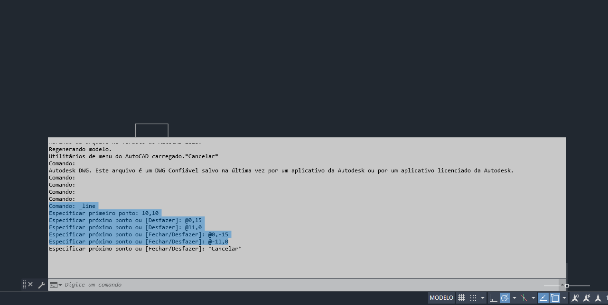

# Criador de tabelas instrucionais do AutoCAD
Este é um pequeno programa pessoal criado para automatizar a criação de imagens(<strong>png</strong>) de tabelas.
Ele foi feito com o intuito de me ajudar a fazer um trabalho da minha faculdade mais rapidamente.
<hr>

<h2>Como funciona</h2>
O primeiro passo é digitar o caminho onde a imagem será criada.
<h4>Exemplo:</h4>

```
C:\Users\User\Documents
```
Agora, as instruções desejadas na linha de comando do AutoCAD devem ser copiadas e coladas no programa (respeitando as quebras de linha)


