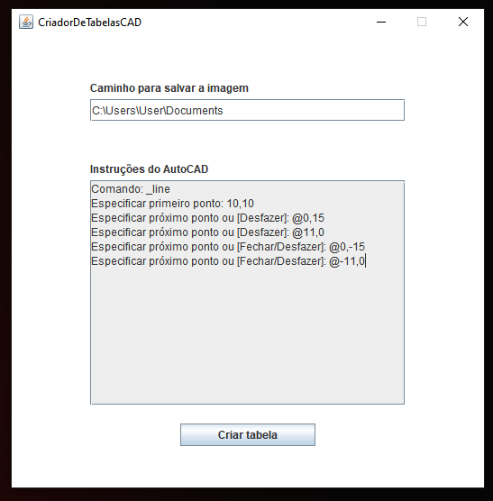

# Criador de tabelas instrucionais do AutoCAD
Este é um programa simples criado para automatizar a criação de imagens(<strong>png</strong>) a partir de tabelas(JTable).
O intuito é criar tabelas que instruem como tal coisa deve ser feita no AutoCAD.
<hr>

<h2>Como funciona</h2>
O primeiro passo é digitar o caminho onde a imagem será criada.
<h4>Exemplo:</h4>

```
C:\Users\User\Documents
```
Agora, as instruções desejadas na linha de comando do AutoCAD devem ser copiadas e coladas para o programa (respeitando as quebras de linha)




Após isso, ao clicar em "Criar tabela" uma imagem "tableImage.png" será criada no caminho especificado.


para usar o programa basta baixar o arquivo .jar e executar.
